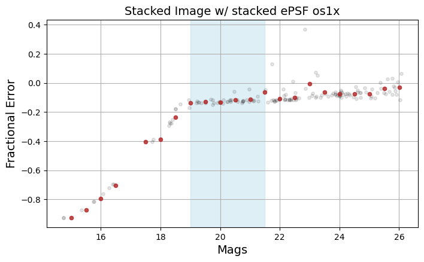
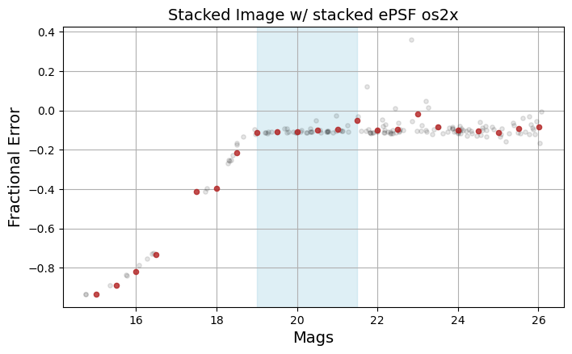
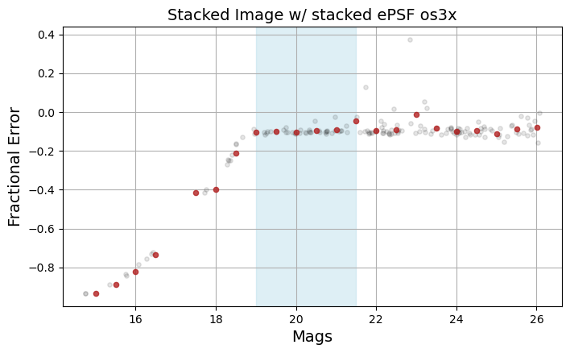
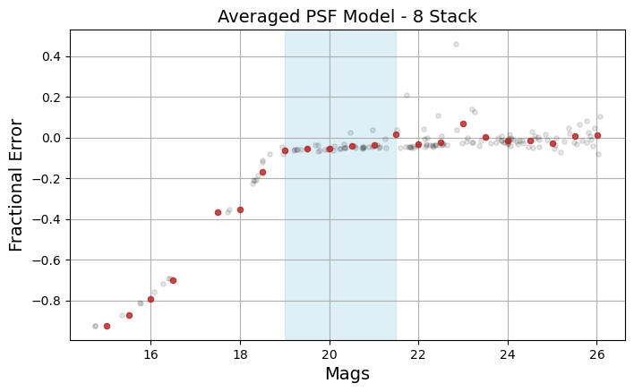

==========
RISE Tests
==========

Image Stacking and Noise Reduction
==================================

The image stacking software that RISE (and RAPID) use to generate stacked science and reference images is `AWAICgen`_.

AWAICgen, originally named AWAIC (A WISE Astronomical Image Coadder), is a software developed at caltech for use on the Wide-Field Infrared Explorer (WISE).

We found that stacking with AWAICgen reduced the noise in the stacked image by roughly a factor of :math:`\sqrt{N}`, where N is the number of images used in the stack.

.. figure:: /images/stack_noise.png
   :width: 400px

   Background cutouts and RMS values of a single OU24 image,
   and 2, 4, and 8 depth stacks. The noise reduction roughly
   follows :math:`\sqrt{N}`.

.. _AWAICgen: https://arxiv.org/abs/0812.4310

PSF & Photometry
================

Effective PSF
-------------

We tested building an Effective Point Spread Function (EPSF) from field stars within the stacked image using `photutils.psf.EPSFBuilder`_.

.. _`photutils.psf.EPSFBuilder`: https://photutils.readthedocs.io/en/stable/api/photutils.psf.EPSFBuilder.html

    Overampling Factor = 1, 2, & 3. Fractional error in measured PSF photometry in field stars versus magntiude of field star.
    Grey points are all used field stars, red points are the mean in 0.5 magnitude bins.

date
^^^^

On this date, we found...

Averaged PSF
------------

We tested rotating and averaging PSF models. Without Roman data, we tested Galsim psf models that were generated to mimic the PSFs used to generate the OpenUniverse2024 dataset.
With the launch of Roman and the beginning of commissioning, we hope to test PSF models from the Roman SOC on real Roman data.

    Rotated and averaged Galsim PSFs. Galsim PSFs generated to mimic the PSFs used to generate OU24 simulations.
    Grey points are all used field stars, red points are the mean in 0.5 magnitude bins.

date
^^^^

Comparison
----------

We found ...

Stacking Scheme
===============

We tested the order in which we stack and subtract. More info on the two stacking methods can be found `here (Link to pipeline_strcture.rst)`.

.. figure:: /images/091126/snr_fig.png
    :width: 1000px

    SNR vs Truth Mag

|img1| |img2|

*Detections :math:`\>5\sigma`. Number of detections compared to truth in 0.25 magntiude bins*

.. |img1| image:: /images/091126/zogy_bar.png
   :width: 500

.. |img2| image:: /images/091126/sfft_bar.png
   :width: 500

.. figure:: 
    :width: 0px

Stack then Sub
--------------

Using the stack then sub method, we found...

Sub then Stack
--------------

Using the sub then stack method, we found...

Limiting Magntiude
==================

