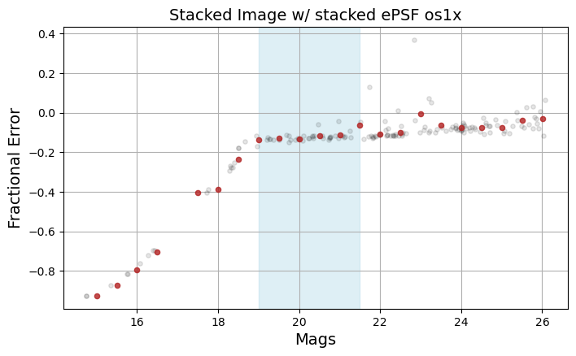
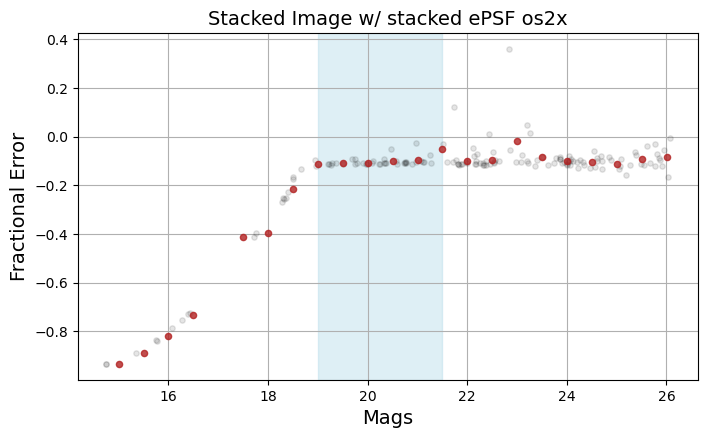
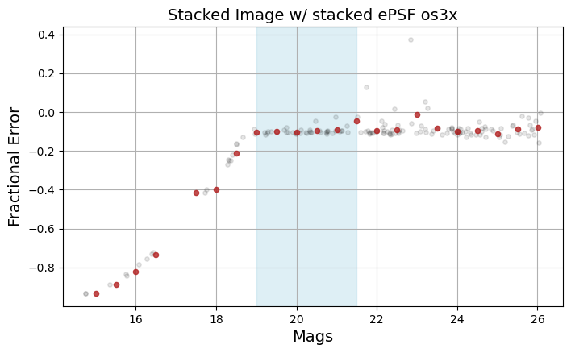
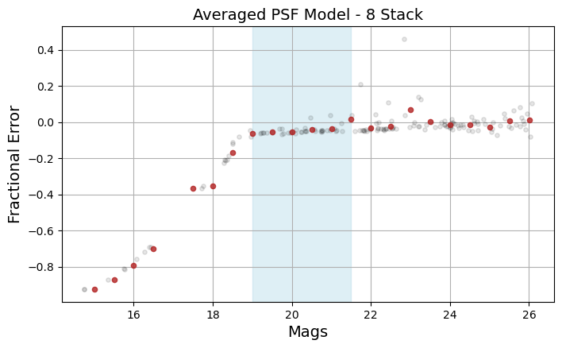

==========
RISE Tests
==========

Image Stacking and Noise Reduction
==================================

The image stacking software that RISE (and RAPID) use to generate stacked science and reference images is `AWAICgen`_.

AWAICgen, originally named AWAIC (A WISE Astronomical Image Coadder), is a software developed at Caltech for use on the Wide-Field Infrared Explorer (WISE).

We found that stacking with AWAICgen reduced the noise in the stacked image by roughly a factor of :math:`\sqrt{N}`, where N is the number of images used in the stack.

.. figure:: /images/stack_noise.png
   :width: 700px

   Background cutouts and RMS values of a single OU24 image,
   and 2, 4, and 8 depth stacks with the same strech applied.
   The noise reduction roughly follows :math:`\sqrt{N}`.

.. _AWAICgen: https://arxiv.org/abs/0812.4310

PSF & Photometry
================

Effective PSF
-------------

We tested building an Effective Point Spread Function (EPSF) from field stars within the stacked image using `photutils.psf.EPSFBuilder`_.

.. _`photutils.psf.EPSFBuilder`: https://photutils.readthedocs.io/en/stable/api/photutils.psf.EPSFBuilder.html

    Overampling Factor = 1, 2, & 3. Fractional error in measured PSF photometry in field stars versus magntiude of field star.
    Grey points are all used field stars, red points are the mean in 0.5 magnitude bins.

Averaged PSF
------------

We tested rotating and averaging PSF models. Without Roman data, we tested Galsim psf models that were generated to mimic the PSFs used to generate the OpenUniverse2024 dataset.
With the launch of Roman and the beginning of commissioning, we hope to test PSF models from the Roman SOC on real Roman data.

    Rotated and averaged Galsim PSFs. Galsim PSFs generated to mimic the PSFs used to generate OU24 simulations.
    Grey points are all used field stars, red points are the mean in 0.5 magnitude bins.

Stacking Scheme Comparison
==========================

We tested the order in which we stack and subtract. More info on the two stacking methods can be found on the :doc:`pipeline_structure` page.
With the recent launch of the Roman Space Telescope, we eagerly await commissioning and early science data to perform analyses on real data.
In the meantime, our tests use the OpenUniverse2024 (OU24) simulated Roman data.

Open Universe 2024 Simulations
------------------------------

To test the efficacy of the two methods, we injected fake sources with randomly generated magnitudes between 25.5 and 29 into galaxies within the OU24 simulations.
We tested to see which stacking and subtracting strategy had the least amount of noise, extracted the most sources (highest completeness), and had a fainter S/N vs truth magnitude relation.

Background Noise
^^^^^^^^^^^^^^^^

We take a star-free, 150pixel by 150pixel cutout in the central region of an epoch,
and compare the standard deviation of this region across the difference images produced by varying stacking schemes and differencing algorithms.
We find differences in background noise between the stacking schemes and the differencing algorithms to be negligible.
The difference in background noise between the most and least noisy image is <1.5%.

.. figure:: /images/noise_comparison.png
    :width: 700px

    Noise comparison between varying stacking scheme and differencing algorithm.

While Sub+Stack is less noisy than Stack+Sub for both SFFT and ZOGY differences, the difference is largely negligible.
From this, we take background noise to be an unilluminating metric by which we can compare the effectiveness of the different stacking schemes.

Injections
^^^^^^^^^^

We analyze filters F184 and R062. We choose to analyze R-band because this filter has the most undersampled PSF of all Roman filters.
We choose F-band as a second filter to compare R-band to.

To choose candidate galaxies to inject into, we used the truth catalog to identify galaxies that had flux counts above some threshold.
We chose this threshold to be 10,000 counts to maximize the number of candidate galaxies, while excluding the faintest.
We then made a full-coverage cut, using only galaxies that had coverage in all epochs that were used in both the science and reference image stacks.

For these injections atop galaxies, we use an 8-stack science image and a 16-stack reference.

|sci_image_injections| |diff_image_injections|

*F-band science image and SFFT Stack+Sub difference image with injections marked. Science image is 8-stack depth, and reference image is 16-stack depth.*

.. |sci_image_injections| image:: /images/cropped_sci_image_galaxy_injections.png
   :width: 500

.. |diff_image_injections| image:: /images/cropped_diff_image_galaxy_injections.png
   :width: 500

After all cuts, a single field in filter F184 had 513 full-coverage galaxies, while a field in R062 had 80 full-coverage galaxies.
Each field in a filter may have slightly more or less full-coverage galaxies.
The sparseness of the R-band images can be attributed to the short exposure time, 161.025s compared to the 901.175s R-band exposures within the OU24 dataset.

|f814_field_with_full_cov_galaxies| |r062_field_with_full_cov_galaxies|

*Difference image of a field in F-band, and another field in R-band, with full-coverage galaxies denoted with green circle regions.
Sparseness of R-band image attributable to the exposure time difference between the two bands in the OU24 dataset -- 901.175s vs 116.025s for F184 and R062 respectively.*

.. |f814_field_with_full_cov_galaxies| image:: /images/f184_field.png
   :width: 500

.. |r062_field_with_full_cov_galaxies| image:: /images/r062_field.png
   :width: 500

For injection positions, we used randomly choosen offset radii between 1.5px = .165" and 10px = 1.1" from the galaxy centroid position as defined in the truth catalog.

To improve statistics on our measurements, we iterated over each field multiple times.
For both F184 and R062, we used 2 different fields.
In the case of F-band, we used 5 realizations of varying galaxy offsets and injection magnitudes for each field.
This totaled to 10 total iterations covering over 4800 injected transients.

For R-band, similarly to our analyses of F-band, we used 2 fields, but generated many more realizations of transient injections.
In total, there were 26 realizations across the 2 fields, totaling to a total injected transient count to just shy of 2000.

We then ran Source Extractor (SExtractor) on the differenced images with the injections, using a 1.5σ threshold (Sextractor DETECT_THRESH parameters) across 3 adjacent pixels (Sextractor DETECT_MINAREA parameter). We then matched the SExtractor
catalog to the injection truth positions. To determine a matching radius between SExtractor coordinates and truth coordinates, we took a look at how the number of sources extracted
varied as a function of matching radius. Below are 3 examples of our match radius findings.

|match_vs_rad_ex1|

|match_vs_rad_ex2|

|match_vs_rad_ex3|

*Number of matched injections vs match radius. Dashed vertical black line marks 0.5px.*

.. |match_vs_rad_ex1| image:: /images/match_vs_rad_iter1.png
   :width: 800

.. |match_vs_rad_ex2| image:: /images/match_vs_rad_iter4.png
   :width: 800

.. |match_vs_rad_ex3| image:: /images/match_vs_rad_iter5.png
   :width: 800

We find that the number of matched injections varies between fields -- and each iteration within a field, though we consistently find that there is a change in slope around 0.5px.
We interpret this as the point when matching to contaminating galaxy residuals dominates over matching to truth injections.
We adopt 0.5px as the match radius for our tests.

We also find the Stack+Sub method extracts more sources in ZOGY difference images, while SFFT is less sensitive to the stacking scheme.

S/N vs Truth Magnitude relation
^^^^^^^^^^^^^^^^^^^^^^^^^^^^^^^

Using our injections atop galaxies, we find the S/N vs truth magnitudes to be comparable in analyses of both R-band and F-band.
We measure S/N using a 4-pixel diameter aperture.

.. figure:: /images/snr_vs_mag_f184.png
    :width: 1000px

    F-band Analysis. SNR vs Truth Magnitude scatter plots of sources detected using with Sextractor that were matched to an injected transient.
    Plots for both ZOGY and SFFT difference images. SNR is obtained using an Sextractor 4-pixel diameter aperture.

.. figure:: /images/snr_vs_mag_r062.png
    :width: 1000px

    R-band Analysis. SNR vs Truth Magnitude scatter plots of sources detected using with Sextractor that were matched to an injected transient.
    Plots for both ZOGY and SFFT difference images. SNR is obtained using an Sextractor 4-pixel diameter aperture.

There is negligible difference between the S/N of a given source between the two stacking methods or the two differencing algorithms in analyses of F-band and R-band, though we find a larger scatter in SFFT within the faintest bins.
The large scatter of faint injections suggests more residual contamination at the faint end with SFFT.
RISE plans to perform basic cuts and Real/Bogus classification to improve our recovery of real sources, though this is work that has not yet been done.

Detection Completeness
^^^^^^^^^^^^^^^^^^^^^^

While the S/N vs magnitude relation is comparable between the two schemes, the two differencing algorithms, and the two filters, the differences in completeness are more apparent.
Below details the comparable analyses performed on F-band images and R-band images, and the ways in which the results from the two cases differ.

Filter F184
"""""""""""
We find that SFFT outperforms ZOGY in the number of sources extracted, while between both differencing algorithms, Stack+Sub appears to extract more sources than Sub+Stack.

Below are bar plots showing the number of sources extracted from a single epoch and from the Stack+Sub and Sub+Stack difference images in 0.5 magnitude bins, compared to truth.

|f_zogy_bar| |f_sfft_bar|

*F-band analysis. Sextractor detections above 5σ. Histrogram shows number of detections in each stacking scheme compared to truth in 0.25 magnitude bins*

.. |f_zogy_bar| image:: /images/zogy_bar_f184.png
   :width: 500

.. |f_sfft_bar| image:: /images/sfft_bar_f184.png
   :width: 500

Below are completeness plots showing the number of sources extracted from a single epoch and from the Stack+Sub and Sub+Stack difference images in 0.5 magnitude bins.

|f_zogy_completeness| |f_sfft_completeness|

*F-band analysis. Sextractor detections above 5σ. Plot shows completeness in each stacking scheme in 0.5 magnitude bins*

.. |f_zogy_completeness| image:: /images/zogy_completeness_f184.png
   :width: 500

.. |f_sfft_completeness| image:: /images/sfft_completeness_f184.png
   :width: 500

In F-band images, we see that SFFT outperforms ZOGY in number of extracted sources, while Stack+Sub outperforms Sub+Stack within SFFT.
The stacking scheme comparison is less clear with ZOGY, though if real Roman data behaves like the OU24 simulations,

Filter R062
"""""""""""
We find that SFFT outperforms ZOGY in the number of sources extracted, while between both differencing algorithms, Stack+Sub appears to extract more sources than Sub+Stack.

Below are bar plots showing the number of sources extracted from a single epoch and from the Stack+Sub and Sub+Stack difference images in 0.5 magnitude bins, compared to truth.

|r_zogy_bar| |r_sfft_bar|

*R-band analysis. Sextractor detections above 5σ. Histrogram shows number of detections in each stacking scheme compared to truth in 0.25 magnitude bins*

.. |r_zogy_bar| image:: /images/zogy_bar_r062.png
   :width: 500

.. |r_sfft_bar| image:: /images/sfft_bar_r062.png
   :width: 500

Below are completeness plots showing the number of sources extracted from a single epoch and from the Stack+Sub and Sub+Stack difference images in 0.5 magnitude bins.

|r_zogy_completeness| |r_sfft_completeness|

*R-band analysis. Sextractor detections above 5σ. Plot shows completeness in each stacking scheme in 0.5 magnitude bins*

.. |r_zogy_completeness| image:: /images/zogy_completeness_r062.png
   :width: 500

.. |r_sfft_completeness| image:: /images/sfft_completeness_r062.png
   :width: 500

In R-band images, we see that SFFT outperforms ZOGY in number of extracted sources, though the difference between the two stacking schemes is negligible for both ZOGY and SFFT.

One hypothesis as to why we see this discrepancy between analysis on R-band and F-band deals with the chacterstics of the galaxies onto which we are injecting.
Because the exposure time of R-band images is shorter than the exposure time of F-band images by a factor of ~5.6,
the distribution of the galaxies that we are injecting onto skews much fainter in count space than the disttribution of candidate injection-galaxies in F-band.
Therefore it's hyposthesized that the R-band injections behave more like injecting atop blank sky, than it does to injecting atop bright galaxies in F-band.

To test this, we redo analysis, looking only at injections atop faint galaxies in F-band to see if we can reproduce the results of our R-band analysis.
We limit our analysis to injections that are within some flux range: the lower limit is 10,000 counts, while the upper limit is taken directly from the injected galaxy with the highest flux count in the R-band image.
This happened to be :math:`2.01\cdot10^5` counts. 

Conclusions
^^^^^^^^^^^

The differences in background noise are neglible between the differencing algorithms and the stacking scheme,
while the S/N vs truth magnitude relation between the 4 methods are also comparable.
Stack+Sub slightly outperforms Sub+Stack when it comes to the number of sources extracted, while SFFT outperforms ZOGY,
likely due to the undersampled PSF models that are used as inputs in ZOGY.

For the OU24 simulations, Stack+Sub performed with SFFT differencing appears to be the best method,
though Roman WFI data may behave differently.

Roman Data
----------

With the successful launch of Roman on Aug. 30th, 2026, we eagerly await a chance to test our pipeline on WFI data!

More details to come.

Limiting Magntiude
==================

More details to come.

